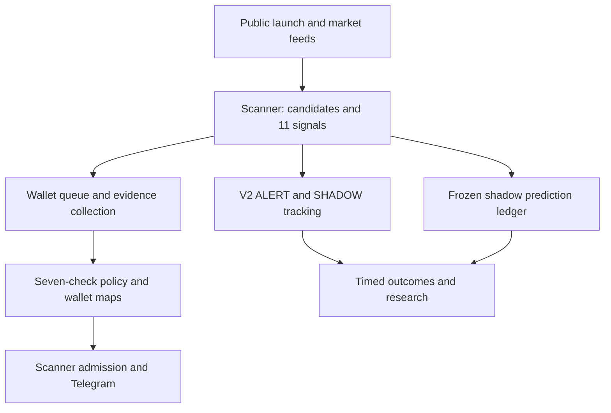

# Vivameda Crypto Lab

A continuously running Solana small-cap observation and research system on Hetzner: early-breakout discovery, on-chain wallet screening, Telegram notifications, wallet maps and forward outcome tracking.

**Start here:** [Full setup showcase](docs/FULL_SETUP.md). This repository is the public source and documentation of the crypto setup. It describes live components, offline experiments and unfinished integrations separately. It is a dated reference, not a live dashboard or a guarantee of profitable trading.

## The system at a glance

| Layer | What it does | Current status |
|---|---|---|
| Discovery and scoring | Collect launches and snapshots; score 11 signals; thresholds 8 / 10 | Live |
| Wallet intelligence | Authenticate pools/creators/holdings; index histories; draw wallet-link maps; seven screening checks | Live; cluster/age/history coverage incomplete |
| Notifications | Scanner admissions plus separate configured-token watchlist and pool/developer observations | Existing server components; source published |
| Forward learning | ALERT/SHADOW cases, timed outcomes, regimes and horizon statistics | Live V2 tracker |
| Prediction ledger | Freeze shadow predictions and later eligible labels for a prospective baseline comparison | Activated; no completed validation claim |
| Numerical model | Seven-feature logistic baseline, published coefficients and evaluation | Experimental; underperformed baseline; does not drive alerts |
| Daily case learning | Matched first-call reviews, fresh agent memory and prospective paper journal | Live daily review and paper journal; daily supervision scheduled; decision-time endpoint extension activated |
| Dedicated Crypto Lab agent | Separate conversations, crypto-only read tools and local evidence interpretation | Isolated runtime activated; separate queue, storage and permissions verified; interpretation blocked by model configuration |
| Agent context | Select dated crypto knowledge and limitations for an agent session | Public extraction; private conversational runtime excluded |
| Trading-agent layer | Paper proposal records, owner feedback and versioned playbook | Scaffold; no continuous agent or live execution |
| Transaction-decoder experiments | Offline DFlow/Pump endpoint reconciliation | Not promoted into production |
| Broad survivor discovery / live trading | Universe-wide survivor discovery and broker/wallet execution | Not implemented |

## How it fits together



The watchlist and pool monitor run separate observation rules; their messages do not inherit scanner screening. The trading scaffold is separate and is not connected to this alert loop.

## Explore the setup

| Guide | Contents |
|---|---|
| [Full setup](docs/FULL_SETUP.md) | Purpose, component inventory, schedules, agents/models, live snapshot and boundaries |
| [Signals](SIGNALS.md) | All 11 score conditions, eligibility gates, regimes and outcome labels |
| [Screening](scout/SCREENING_V2.md) | Seven decisions, freshness and admission policy |
| [Wallet operations](scout/WALLET_INTELLIGENCE.md) | Queue, RPC budgets, coverage and storage guardrails |
| [Monitor signals](docs/MONITORS.md) | Watchlist, pool levels, activity, controls, account and vesting observations |
| [Architecture](docs/ARCHITECTURE.md) | Source entry points, data flow and external effects |
| [Research](research/README.md) | Baseline result, training schema and evaluation limits |
| [Daily case learning](learning/README.md) | Matching rules, paper journal, agent integration, daily schedules and activation |
| [Dedicated Crypto Lab agent](agent/CRYPTO_LAB.md) / [Earlier activation](agent/CRYPTO_AGENT_ACTIVATION_20261005.md) / [Runtime separation](agent/runtime/RUNTIME_SEPARATION.md) / [Runtime activation](agent/runtime/RUNTIME_ACTIVATION_20261005.md) | Domain boundary, dedicated queue/services, installation status and model limitations |
| [Trading scaffold](agent_trader/README.md) | Paper proposals, feedback and execution integration requirements |
| [Setup](docs/SETUP.md) | Dependencies, installation, health checks and rollback |
| [Coverage](docs/COMPLETENESS.md) / [Validation](docs/VALIDATION.md) | Included source, tests and unresolved gaps |
| [Update policy](docs/REPOSITORY_POLICY.md) | Required GitHub synchronization for crypto changes |
| [Security](SECURITY.md) | Public/private boundary |

## Verify the source

```sh
python3 -m venv .venv
.venv/bin/python -m pip install -r requirements.txt -r research/requirements.txt
.venv/bin/python -m unittest discover -s scout -p 'test_*.py'
.venv/bin/python -m unittest discover -s research -p 'test_*.py'
.venv/bin/python -m unittest discover -s agent -p 'test_*.py'
.venv/bin/python -m unittest discover -s agent_trader -p 'test_*.py'
python3 -m unittest discover -s learning -p 'test_*.py'
python3 scripts/verify_release.py
```

A score is not a probability. Activity age is a lower bound, not a creation date. Transfer links do not establish common ownership. Peak multiples are not realized profit. Missing evidence remains missing.

The experimental model used 42 training and 18 test tokens: Brier 0.11047 versus baseline 0.10034 (lower is better). No profitable strategy, completed prospective validation, Qwen weight training or automated trade execution is claimed.

Credentials, private live configuration, databases, messages, client material and the separate workforce stack remain server-side. Source templates do not reproduce private runtime state. Fresh-host installation remains unverified. No license grant has yet been selected.
